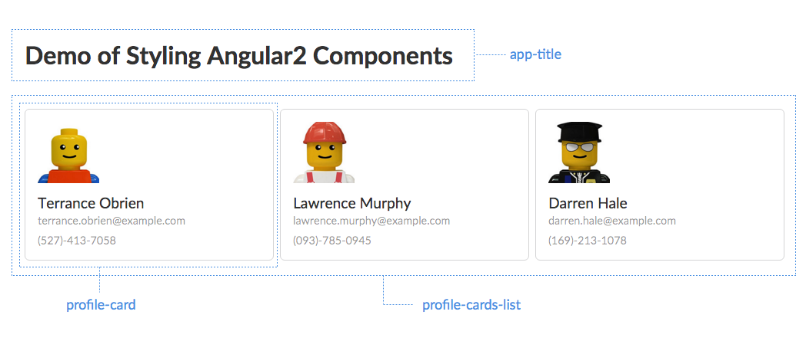

# Angular2 Styling Components Demo



## Installation

```
$ npm install
```

## Running the demo

```
$ npm start
```

## Note

The dummy user data is generated by [Random User Generator API](https://randomuser.me/).
